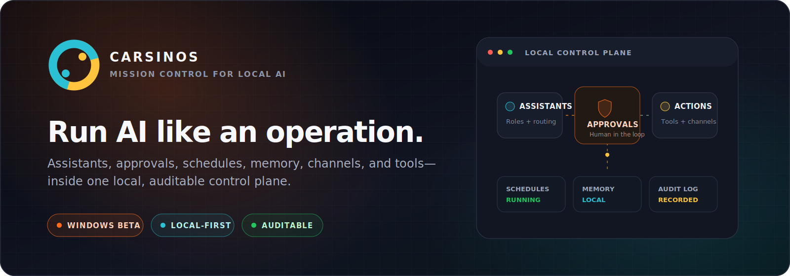
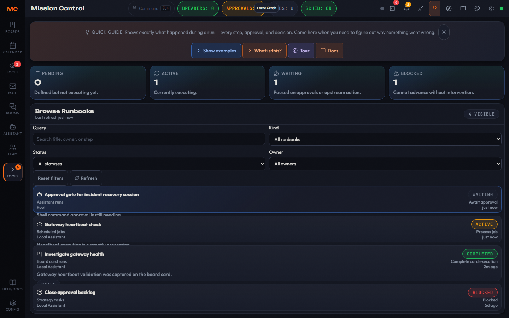
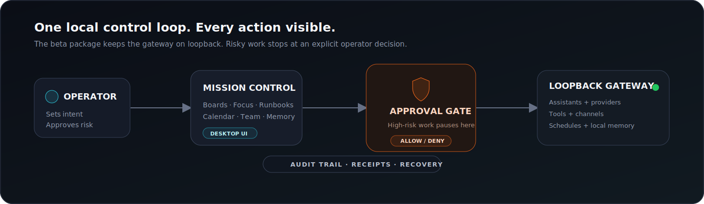
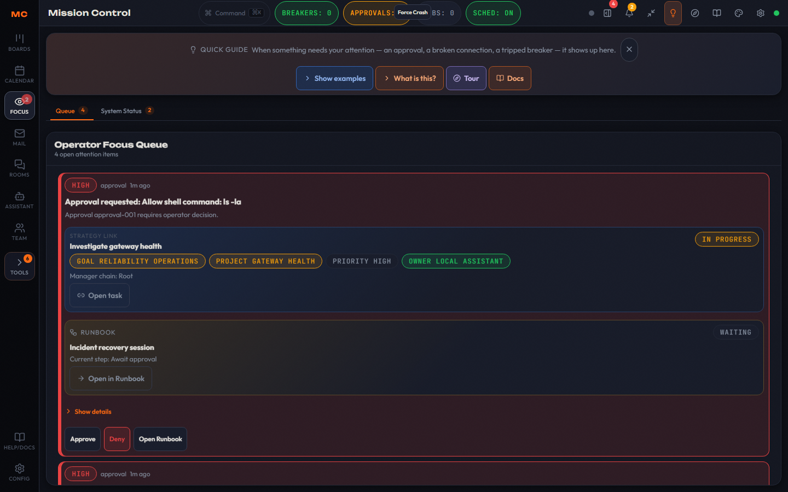
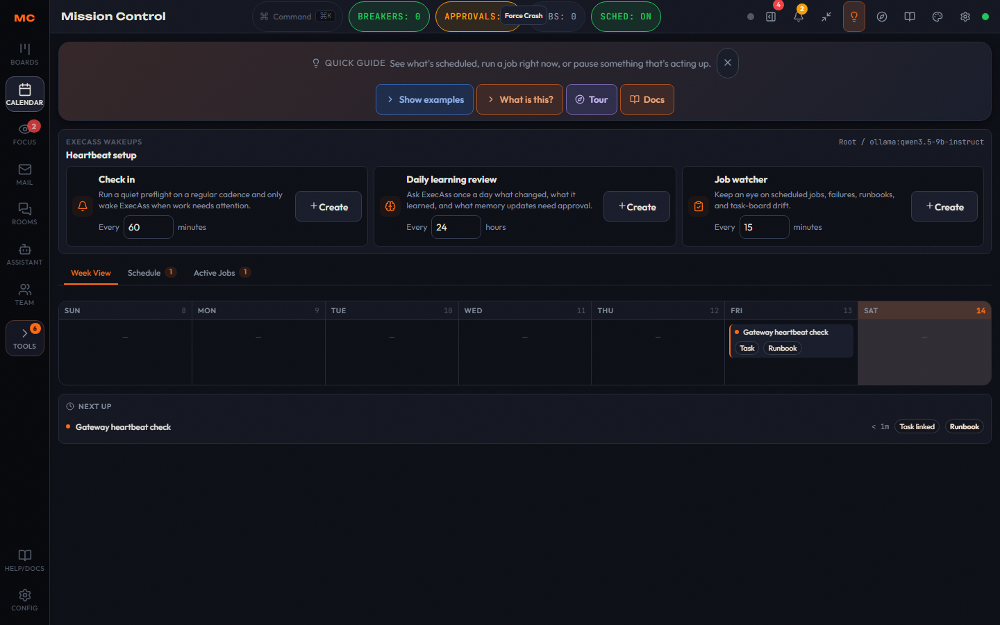
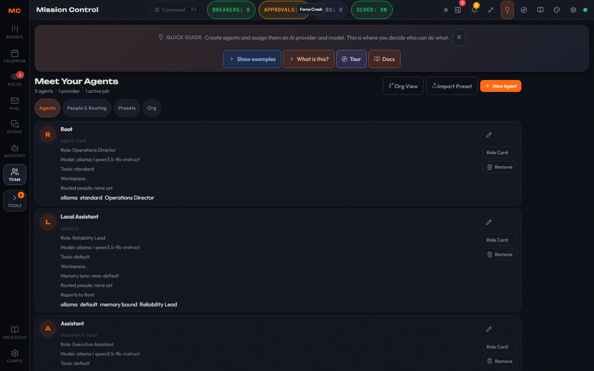
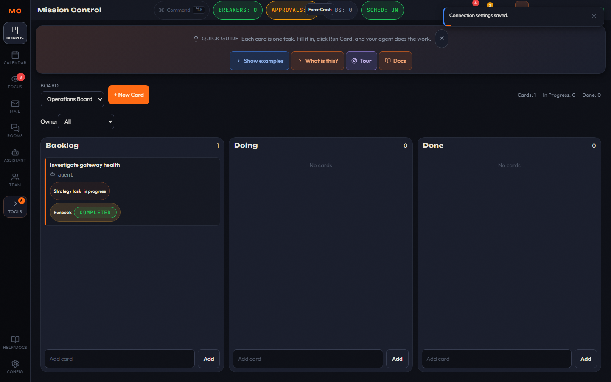

# CarsinOS

<!-- markdownlint-disable MD013 MD033 -->

<p align="center">
  
</p>

<p align="center">
  <a href="https://github.com/EmergentKnowledgeGroup/CarsinOS/releases/tag/v0.1.0-beta"></a>
  
  
  <a href="LICENSE"></a>
  <a href="https://github.com/EmergentKnowledgeGroup/CarsinOS/branches"></a>
</p>

<p align="center">
  <strong>One place to run assistants, approve risky work, schedule jobs, connect channels, manage memory, and see exactly what happened.</strong>
</p>

<p align="center">
  <a href="https://github.com/EmergentKnowledgeGroup/CarsinOS/releases/tag/v0.1.0-beta"><strong>Download the Windows beta</strong></a>
  ·
  <a href="docs/WINDOWS_BETA_INSTALL_BACKUP_RESTORE.md">Install guide</a>
  ·
  <a href="docs/releases/v0.1.0-beta.md">Release notes</a>
  ·
  <a href="SECURITY.md">Security</a>
</p>

---

## The simple version

CarsinOS turns a pile of AI scripts, agents, tools, and chat connections into an
operation you can actually supervise.

- **Tell it what needs doing.** Create work from Boards, Calendar, chat, or a connected channel.
- **Keep humans in control.** High-risk actions stop for an explicit approve-or-deny decision.
- **Know what happened.** Runbooks, event history, receipts, and recovery state make work auditable.
- **Keep the control plane local.** The Windows beta bundles a token-authenticated gateway on `127.0.0.1`.

No mystery daemon on somebody else's server. No silent tool execution. No
guessing which assistant did what.

<p align="center">
  <a href="docs/assets/screenshots/mission-control-runbooks.png"></a>
</p>

<p align="center"><sub>Mission Control's Runbooks view: active work, approval waits, completed runs, and blocked work in one place.</sub></p>

## One local control plane

<p align="center">
  
</p>

CarsinOS is built around one deliberately boring rule: **the operator stays in
the loop**. Mission Control makes intent visible, the gateway enforces runtime
boundaries, approval gates pause risky actions, and the audit trail records the
result.

| Surface | What it gives you |
| --- | --- |
| **Mission Control** | A desktop command center for work, agents, approvals, schedules, channels, memory, tools, and system health. |
| **Assistant routing** | Named agents with provider/model ordering, roles, workspaces, tool posture, and per-lane memory. |
| **Approvals + Focus** | One operator queue for decisions, broken connections, circuit breakers, and other work that needs a human. |
| **Boards + Runbooks** | Turn a task card into executable work, then follow each step, decision, wait, and result. |
| **Calendar + wakeups** | Run scheduled jobs, heartbeats, check-ins, learning reviews, and job-watch routines. |
| **Channels + connectors** | Route assistant work through supported chat channels and imported tools without hiding connection state. |
| **Local memory** | Per-agent memory notes, local retrieval, bounded prompt injection, and explicit routing controls. |
| **Safety + recovery** | Token auth, loopback defaults, scoped tools, audit events, checksummed backups, and tested restore paths. |

## See the system, not just the pitch

<table>
  <tr>
    <td width="50%">
      <a href="docs/assets/screenshots/mission-control-approvals.png"></a>
      <br /><strong>Human approval before high-risk action</strong>
    </td>
    <td width="50%">
      <a href="docs/assets/screenshots/mission-control-calendar.png"></a>
      <br /><strong>Schedules and assistant wakeups</strong>
    </td>
  </tr>
  <tr>
    <td width="50%">
      <a href="docs/assets/screenshots/mission-control-team.png"></a>
      <br /><strong>Agents, roles, providers, and routing</strong>
    </td>
    <td width="50%">
      <a href="docs/assets/screenshots/mission-control-boards.png"></a>
      <br /><strong>Work that stays tied to execution</strong>
    </td>
  </tr>
</table>

> The screenshots use deterministic demo data from the release QA suite. They
> show real Mission Control surfaces, not concept art.

## Get CarsinOS

### Windows public beta — easiest path

The `v0.1.0-beta` prerelease contains the Windows x64 MSI, checksum file,
release manifest, and SBOM.

1. Open the [v0.1.0-beta release](https://github.com/EmergentKnowledgeGroup/CarsinOS/releases/tag/v0.1.0-beta).
2. Download `CarsinOS-Mission-Control-v0.1.0-beta-windows-x64.msi` and `SHA256SUMS.txt`.
3. Verify the MSI before opening it:

```powershell
$Installer = 'C:\Path\To\CarsinOS-Mission-Control-v0.1.0-beta-windows-x64.msi'
$Expected = '<SHA-256 from the matching SHA256SUMS.txt>'
$Actual = (Get-FileHash -Algorithm SHA256 -LiteralPath $Installer).Hash
if ($Actual -ne $Expected.ToUpperInvariant()) { throw 'MSI checksum mismatch.' }
```

Published MSI SHA-256:

```text
b125cb12ce6d082a1e96e6d66bc5acdc0c6b0b87ebcde14bd96648420ae4ae2e
```

Then follow the [Windows install, backup, and restore guide](docs/WINDOWS_BETA_INSTALL_BACKUP_RESTORE.md).

### Run from source

You need a Rust toolchain. Node.js is also required when running or building
Mission Control from source.

Start the gateway:

Generate a unique token and keep it local. The prompt below avoids placing the
token directly in the command or shell history:

```bash
git clone https://github.com/EmergentKnowledgeGroup/CarsinOS.git
cd CarsinOS
read -rsp "Gateway token: " CARSINOS_GATEWAY_TOKEN && printf '\n'
export CARSINOS_GATEWAY_TOKEN
cargo run -p carsinos-gateway
```

Check that it is healthy:

```bash
curl --fail --show-error \
  -H "Authorization: Bearer ${CARSINOS_GATEWAY_TOKEN}" \
  http://127.0.0.1:18789/api/v1/health
```

Or use the one-click launcher for the gateway plus Mission Control:

```powershell
powershell -ExecutionPolicy Bypass -File .\scripts\one_click_launch.ps1
```

```bash
./scripts/one_click_launch.sh
```

Windows users can also double-click `scripts\one_click_launch.cmd`. The
launcher prompts for Desktop or Web mode, auto-generates a token when you leave
the prompt blank, reclaims stale repo-owned processes, shifts web ports when
needed, and writes logs under `runtime/oneclick-state/logs/`.

<details>
<summary><strong>Launcher options and macOS source packaging</strong></summary>

PowerShell accepts `-Web` / `-Tauri`, `-GatewayPort`, `-UiPort`, `-Token`,
`-StateDir`, and `-CargoTargetDir`. On macOS, the Finder launcher is
`scripts/one_click_launch.command`.

To create a local macOS app bundle from source:

```bash
cargo run -p carsinos-cli -- package-macos --release
```

The bundle is written to `target/dist/carsinOS.app` by default. macOS packaging
is a source-build path; the public beta distribution is Windows x64.

</details>

## Public-beta boundaries

This is a real public prerelease, not a claim of finished-product maturity.

- **Windows x64 desktop is the supported beta experience.** Narrow/mobile Cockpit layouts are not a supported target.
- **The MSI is unsigned.** Windows may show an unknown-publisher or reputation warning; verify the checksum first.
- **The beta is local-only.** Its bundled gateway listens on loopback. Do not expose it publicly.
- **There is no auto-updater.** New releases require an intentional download and install.
- **State survives uninstall.** Durable state lives outside the MSI directory. Verified backups exclude credentials, so secrets must be re-entered after restore.
- **Extended provider/channel/scheduler soak coverage was not part of this release gate.** See the [release notes](docs/releases/v0.1.0-beta.md) for the exact evidence and residual risks.

## Architecture

CarsinOS is a Rust workspace with a TypeScript/React Mission Control frontend
and a Tauri desktop shell.

```text
Mission Control (React + Tauri)
          │
          │ token-authenticated HTTP + WebSocket
          ▼
CarsinOS gateway (Rust, loopback by default)
          │
          ├── assistants + provider routing
          ├── approvals + audit events
          ├── schedules + runbooks + boards
          ├── channels + connector registry
          ├── scoped tools + browser capability
          └── SQLite state + local memory + backups
```

Key workspace areas:

- `apps/mission-control/` — Mission Control web UI and Tauri desktop package
- `crates/carsinos-gateway/` — authenticated API, WebSocket events, orchestration, and runtime policy
- `crates/carsinos-storage/` — SQLite migrations, state, provenance, and recovery surfaces
- `crates/carsinos-providers/` — model-provider adapters and auth policy
- `crates/carsinos-channels/` — channel adapters and routing
- `crates/carsinos-tools/` — scoped local and network tool execution
- `scripts/` — launchers, release packaging, security gates, backup, and lifecycle proof

## Security model

The beta favors explicit boundaries over invisible convenience:

- loopback gateway by default
- bearer-token bootstrap for the packaged desktop app
- operator approval gates for high-risk actions
- allowlisted filesystem roots, executable binaries, and network targets
- keychain-backed secret references rather than plaintext credentials in state
- structured audit events, run receipts, backups, and recovery checks
- per-PR security and Mission Control quality gates on protected `main`

Please report suspected vulnerabilities privately according to
[`SECURITY.md`](SECURITY.md). Do not open a public issue containing exploit
details, credentials, or personal data.

<details>
<summary><strong>Important runtime configuration</strong></summary>

| Variable | Purpose |
| --- | --- |
| `CARSINOS_GATEWAY_BIND` | Gateway address; defaults to `127.0.0.1:18789`. |
| `CARSINOS_GATEWAY_TOKEN` | Static bearer token; generated at startup when omitted. |
| `CARSINOS_STATE_DIR` | Override the durable state directory. |
| `CARSINOS_AUTH_MODE` | `static_bearer` or `jwt`. |
| `CARSINOS_PUBLIC_BIND_ALLOWED` | Explicit opt-in required for a non-loopback source deployment. |
| `CARSINOS_TOOL_ALLOWED_ROOTS` | Filesystem roots available to file and execution tools. |
| `CARSINOS_TOOL_ALLOWED_BINARIES` | Executable allowlist for `tool.exec`. |
| `CARSINOS_TOOL_NETWORK_POLICY` | `allowlist` or `deny_all` for web tools. |
| `CARSINOS_OPERATOR_ALLOWLIST` | Operators allowed to make approval decisions. |
| `CARSINOS_SECRET_STORE` | `keychain` or test-only/in-memory secret storage. |
| `CARSINOS_LOCAL_MEMORY_ENABLED` | Enables local memory retrieval. |
| `CARSINOS_LOG_FORMAT` | `compact`, `text`, `pretty`, or `json`. |

Public binds additionally require the repository's TLS/proxy safety controls.
The packaged beta does not support public hosting.

</details>

## Build and verify

```bash
cargo fmt --all -- --check
cargo test --workspace --locked
```

Mission Control:

```bash
cd apps/mission-control
npm ci
npm run typecheck
npm run lint
npm run test:unit
npm run build
```

Security and release verification:

```bash
scripts/security_pr_gate.sh
scripts/security_nightly_deep_scan.sh
scripts/security_killswitch_drill.sh
scripts/security_secret_lifecycle_drill.sh
```

Security artifacts are written under `runtime/security/reports/`. GitHub's
protected `main` branch requires the security PR gate and Mission Control
quality gate before merge.

## Documentation map

| I want to… | Start here |
| --- | --- |
| Install, back up, or restore the beta | [Windows beta guide](docs/WINDOWS_BETA_INSTALL_BACKUP_RESTORE.md) |
| See exactly what shipped | [v0.1.0-beta release notes](docs/releases/v0.1.0-beta.md) |
| Audit the public release evidence | [Public release checklist](docs/PUBLIC_RELEASE_CHECKLIST.md) |
| Understand the security posture | [Security policy](SECURITY.md) and [threat model package](docs/security/THREAT_MODEL_PACKAGE.md) |
| Contribute through the required workflow | [Git and PR workflow](docs/GIT_PR_WORKFLOW.md) |
| Understand autonomy guardrails | [Autonomy guardrails and observability](docs/AUTONOMY_GUARDRAILS_OBSERVABILITY.md) |

## Contributing

CarsinOS is public and auditable. Issues and focused pull requests are welcome.
Before opening a PR:

1. Read [`CONTRIBUTING.md`](CONTRIBUTING.md) and the maintainer-oriented [`docs/GIT_PR_WORKFLOW.md`](docs/GIT_PR_WORKFLOW.md).
2. Keep changes narrowly scoped and include tests for behavior changes.
3. Run the relevant Rust, Mission Control, and security checks.
4. Include the verification commands and results in the PR description.

Please use [`SECURITY.md`](SECURITY.md) instead of public issues for
vulnerabilities.

## License

CarsinOS is available under the [MIT License](LICENSE).

---

<p align="center">
  <strong>Local AI should still feel like your system.</strong><br />
  Inspect it. Approve it. Recover it. Own it.
</p>
