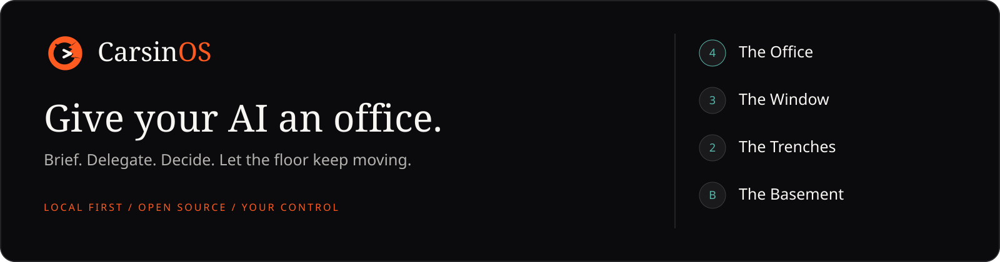
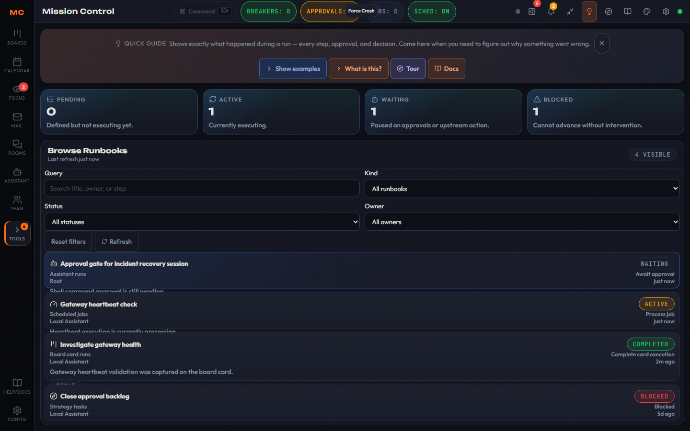
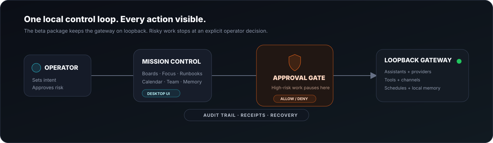

# CarsinOS

<p align="center">
  
</p>

<p align="center">
  
  
  <a href="LICENSE"></a>
  <a href="SECURITY.md"></a>
</p>

<p align="center">
  <strong>A local control plane for an executive assistant, its tools, its work, and the evidence behind every important result.</strong>
</p>

<p align="center">
  <a href="docs/GETTING_STARTED.md"><strong>Get started</strong></a>
  · <a href="docs/ARCHITECTURE.md">Architecture</a>
  · <a href="docs/SECURITY_MODEL.md">Security model</a>
  · <a href="CONTRIBUTING.md">Contribute</a>
</p>

---

## What CarsinOS is

CarsinOS helps one person run an AI-assisted operation without turning it into a
black box. You give **ExecAss** an outcome; it coordinates durable work while
CarsinOS keeps the state, control, receipts, schedules, tools, and recovery
paths visible underneath.

- **One owner, one ExecAss, one local system.** This is not a multi-tenant
  platform or shared agent marketplace.
- **Ordinary owner instructions proceed.** CarsinOS does not police what you
  can ask your assistant to do.
- **Dangerous work gets one clear confirmation.** It says what will happen;
  once confirmed, that reasoning follows unchanged work through normal
  continuation and recovery.
- **The operation stays inspectable.** Mission Control shows active work,
  decisions, schedules, messages, receipts, system posture, and recovery state
  instead of hiding them behind a chat transcript.

<p align="center">
  <a href="docs/assets/screenshots/mission-control-runbooks.png"></a>
</p>

<p align="center"><sub>Mission Control makes work, decisions, and their evidence visible in one place.</sub></p>

## What you can run from Mission Control

| Surface | Purpose |
| --- | --- |
| **Office** | A calm executive view of what needs you, what is moving, what finished, and what comes next. |
| **Boards and runbooks** | Turn work into durable, inspectable execution instead of a loose chat promise. |
| **Calendar and wakeups** | Schedule jobs, heartbeats, and intentional follow-ups. |
| **Agents, models, and connectors** | See the assistants, provider paths, channel connections, and tool boundaries involved in work. |
| **Agent Mail and Chatter** | Keep collaboration in a durable message authority rather than inventing a second chat store. |
| **Receipts and history** | Trace important claims back to durable evidence and honest partial outcomes. |
| **Safety and recovery** | Use explicit confirmations, scoped tools, local state, and recovery-aware runtime controls. |

<p align="center">
  
</p>

## Start from source

This freshly public repository is **source-first**. It does not currently host
a packaged GitHub release; do not download an installer from a third party and
assume it is CarsinOS.

```bash
git clone https://github.com/EmergentKnowledgeGroup/CarsinOS.git
cd CarsinOS
cargo run -p carsinos-gateway
```

In a second terminal, start Mission Control:

```bash
cd apps/mission-control
npm ci
npm run dev
```

Read [Getting started](docs/GETTING_STARTED.md) for the fuller setup path,
desktop-shell commands, and operational boundaries.

## Public repository boundaries

This repository deliberately contains source, public documentation, community
files, and CI configuration—not internal planning boards, agent handoffs,
checkpoint ledgers, audit scratchpads, or local runtime artifacts. That keeps
the project understandable without publishing the machinery used to build it.

Read the [security model](docs/SECURITY_MODEL.md) before exposing a source
instance beyond your own machine. The intended default is local and
loopback-bound.

## Documentation

| Looking for | Start here |
| --- | --- |
| Install and run from source | [Getting started](docs/GETTING_STARTED.md) |
| How the pieces fit together | [Architecture](docs/ARCHITECTURE.md) |
| Security and operational boundaries | [Security model](docs/SECURITY_MODEL.md) |
| Current release availability | [Releases](docs/RELEASES.md) |
| Vulnerability reporting | [Security policy](SECURITY.md) |
| Contributions and support | [Contributing](CONTRIBUTING.md) and [Support](SUPPORT.md) |

## Contributing

Focused fixes, tests, documentation, accessibility work, and well-bounded
feature proposals are welcome. Please read [CONTRIBUTING.md](CONTRIBUTING.md),
use the issue forms, and keep secrets, private runtime state, and vulnerability
details out of public discussion.

## License

CarsinOS is available under the [MIT License](LICENSE).

---

<p align="center">
  <strong>Local AI should still feel like your system.</strong><br />
  Inspect it. Confirm it. Recover it. Own it.
</p>
