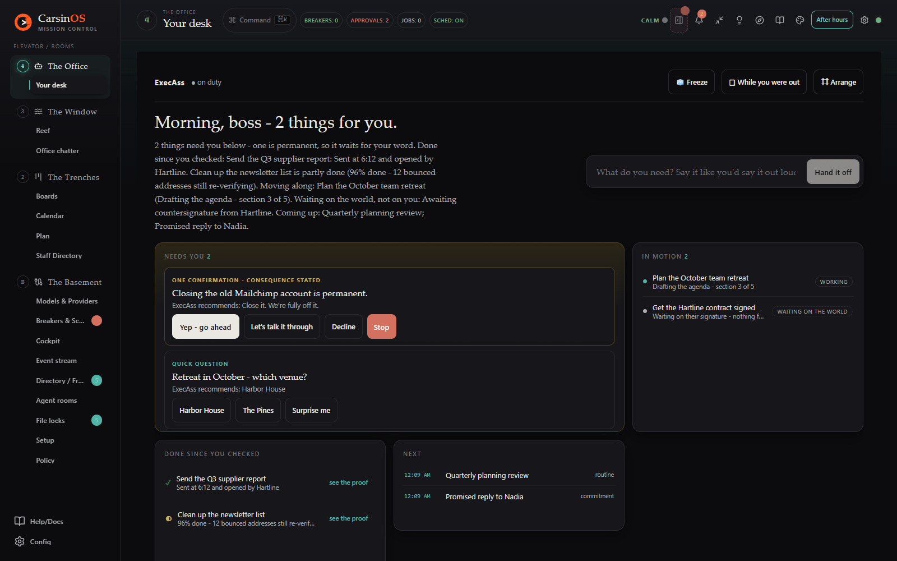

# CarsinOS

<p align="center">
  
</p>

<p align="center">
  
  
  <a href="LICENSE"></a>
  <a href="SECURITY.md"></a>
</p>

<p align="center">
  <strong>Give your assistant an outcome. Follow the work. Inspect the result.</strong>
</p>

<p align="center">
  <a href="docs/GETTING_STARTED.md"><strong>Get started</strong></a>
  · <a href="docs/GETTING_STARTED.md#complete-the-setup-wizard">First-run setup</a>
  · <a href="docs/CONCEPTS.md">How it works</a>
  · <a href="docs/ARCHITECTURE.md">Architecture</a>
  · <a href="docs/ENGINEERING.md">Engineering</a>
  · <a href="docs/SECURITY_MODEL.md">Security model</a>
</p>

---

## Your assistant. Your office. Your control.

CarsinOS is for one owner running one ExecAss coordinator through one local
instance. You give ExecAss an outcome in plain language. CarsinOS keeps the
delegated work, decisions, schedules, tools, receipt-backed evidence, and
recovery state visible around it. ExecAss can coordinate configured workers,
providers, tools, and channels within that owner authority; those do not become
additional owners.

It is deliberately opinionated about one thing: your instruction matters.
Ordinary owner requests take their normal execution path rather than becoming a
permission maze. An exact dangerous ExecAss action gets one concrete
confirmation: the system says what will happen, you confirm or clarify, and an
unchanged action can carry that decision forward. Material drift means it needs
a fresh decision.

## The product in a minute

1. **Start at the Office.** Read a calm briefing, hand off an outcome, and see
   what needs a decision versus what is already moving.
2. **Make work durable.** Boards, plans, schedules, history, and receipts keep
   work inspectable after the conversation has moved on.
3. **Keep the machinery visible.** See the configured assistants, providers,
   connectors, policy, file reservations, event stream, and breakers that shape
   execution.
4. **Recover from truth, not vibes.** Mission Control distinguishes a known
   calm system, a specific incident, and a state that is still checking its
   authoritative facts.

## The Glass Office

Four floors, one workspace: **4F The Office**, **3F The Window**,
**2F The Trenches**, and **B The Basement**.

[](docs/assets/screenshots/mission-control-office.png)

The application opens at your Office. Read the briefing, delegate an outcome,
resolve decisions, inspect receipts, or open detailed assistant chat.
The elevator connects to the crew, boards, schedules, and operational rooms.
Carbon and Porcelain themes follow you across the building.

[The Window](docs/assets/screenshots/mission-control-window.png) ·
[Boards](docs/assets/screenshots/mission-control-boards.png) ·
[Calendar](docs/assets/screenshots/mission-control-calendar.png) ·
[Setup](docs/assets/screenshots/mission-control-setup.png) ·
[Design history and runtime boundaries](docs/GLASS_OFFICE_STATUS.md)

These are captures of the real React application with isolated test data.
They do not represent live customer work or prove a configured model/provider.
[Run the application](docs/GETTING_STARTED.md), or explore the
[original standalone design prototype](demos/glass-office/README.md).

## What lives in Mission Control

| Place | What it is for |
| --- | --- |
| **The Office** | Your daily desk: briefing, delegation intake, meaningful decisions, work in motion, receipts, and what comes next. |
| **The Window** | A view of observed agent presence and office chatter when the relevant capability is configured. |
| **The Trenches** | Boards, calendar, strategy, staff, and history/receipts—the operational surfaces where work stays durable. |
| **The Basement** | Providers, connectors, breakers, cockpit, events, directory, agent rooms, memory, file locks, setup, and policy. |
| **Config and Help** | A direct route to configuration, guided tour, and product help without burying operational work. |

The elevator is registry-driven: rooms have stable identities and can be shown,
hidden, ordered, or capability-gated without turning navigation into a pile of
route-specific special cases. See [Architecture](docs/ARCHITECTURE.md) for the
engineering view.

## A guided start

**Yes, CarsinOS has onboarding.** A six-step Setup Wizard opens when configuration
is incomplete: choose Quickstart or Manual, check readiness, connect the gateway,
configure an assistant and provider, review, and choose where to start. A separate
guided tour introduces the interface.

[View the current application's Setup Wizard](docs/assets/screenshots/mission-control-onboarding.png).

Reopen it through **Settings → Setup Wizard** or **The Basement → Setup**.
[Follow the setup walkthrough](docs/GETTING_STARTED.md#complete-the-setup-wizard).
The wizard configures an already-running instance; it does not install Rust,
download a local model, or turn browser mode into a native owner runtime.

## A first useful session

1. [Build and run a local instance](docs/GETTING_STARTED.md).
2. Complete the [Setup Wizard](docs/GETTING_STARTED.md#complete-the-setup-wizard)
   to connect the gateway and configure your assistant and provider.
3. At the Office, tell ExecAss the outcome as you would tell a capable
   secretary.
4. Open **Needs You** only when a decision is actually required. Read the
   stated consequence before accepting a dangerous action.
5. Open a receipt or history item when you need evidence for an important
   outcome, not merely a chat claim.

## Pick your path

| If you want to… | Start here |
| --- | --- |
| Build and run a local instance | [Getting started](docs/GETTING_STARTED.md) |
| Understand the owner / ExecAss / work model | [Concepts](docs/CONCEPTS.md) |
| See how the Rust, UI, protocol, and storage pieces fit | [Architecture](docs/ARCHITECTURE.md) |
| Change or test the project responsibly | [Engineering guide](docs/ENGINEERING.md) |
| Understand local, credential, confirmation, and tool boundaries | [Security model](docs/SECURITY_MODEL.md) |
| Check what is actually available to download | [Releases](docs/RELEASES.md) |
| Contribute a focused improvement | [Contributing](CONTRIBUTING.md) |

## Start from source

CarsinOS is currently source-first. There is no packaged GitHub release for the
current public `main` source tree, so do not download an installer from a third
party and assume it is CarsinOS.

```bash
git clone https://github.com/EmergentKnowledgeGroup/CarsinOS.git
cd CarsinOS
```

Then follow [Getting started](docs/GETTING_STARTED.md) for the development
modes, token/configuration boundary, desktop-shell differences, and validation
commands.

## Contributing

Focused fixes, tests, documentation, accessibility work, and well-bounded
feature proposals are welcome. Please read [CONTRIBUTING.md](CONTRIBUTING.md),
use the issue forms, and keep secrets, private runtime state, and vulnerability
details out of public discussion.

## License

CarsinOS is available under the [MIT License](LICENSE).

---

<p align="center">
  <strong>Local AI should still feel like your system.</strong><br />
  Inspect it. Confirm it. Recover it. Own it.
</p>
