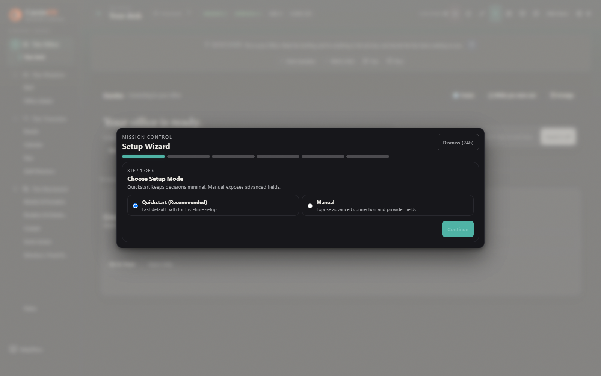

# Getting started with CarsinOS

CarsinOS is a local-first Rust workspace with a React/Tauri operator interface
called Mission Control. The public repository is currently source-first: it
contains the project needed to build and run local development modes, but it
does not yet publish a packaged GitHub installer.

If you are evaluating the product rather than building it, read
[How CarsinOS works](CONCEPTS.md) first. This page explains the local source
workflow and, importantly, what each development mode can and cannot do.

## What you need

- Git
- A current Rust toolchain
- Node.js 22 for the Mission Control workflow used in CI
- The platform prerequisites needed by Tauri if you will run the desktop shell
- A local environment where gateway tokens and runtime state can remain private

Windows is the primary desktop target in the current project shape. The
canonical owner-confirmation custody is implemented for Windows and macOS;
Linux remains useful for source development and testing, but should not be
treated as a full canonical-owner runtime claim.

## Understand the three local modes

| Mode | Good for | Important boundary |
| --- | --- | --- |
| **Gateway only** | API, storage, and backend development | You configure the gateway token and state directory yourself. |
| **Browser / Vite UI** | UI development and ordinary gateway-backed surfaces | It can connect with a token, but browser mode cannot sign ExecAss owner intake, mutation, or decision proofs. |
| **Tauri desktop shell** | Desktop UI development | Debug Tauri does not start the managed gateway sidecar. The release desktop path is where managed sidecar/keyring behavior belongs. |

This is why a two-terminal browser demo is useful but is not a promise that a
fresh source checkout delivers the entire production-like ExecAss authority
path with no configuration.

## 1. Clone the source

```powershell
git clone https://github.com/EmergentKnowledgeGroup/CarsinOS.git
cd CarsinOS
```

Use the repository you cloned. Do not run an executable, script, or installer
that claims to be CarsinOS unless it came from an official release page linked
from this repository.

## 2. Start a deliberate local development gateway

The gateway defaults to `127.0.0.1:18789`. Set a repeatable, private token
explicitly before running it; otherwise the gateway generates a new runtime
token that is not a convenient shared setup value for a second terminal.

In PowerShell, choose a long unique local value and use the same value in the
Mission Control terminal below:

```powershell
$env:CARSINOS_GATEWAY_TOKEN = "replace-with-a-long-private-local-token"
$env:CARSINOS_STATE_DIR = "$PWD\runtime\dev-state"
cargo run -p carsinos-gateway
```

In a macOS/Linux POSIX shell, use the same names and the same token value:

```bash
export CARSINOS_GATEWAY_TOKEN="replace-with-a-long-private-local-token"
export CARSINOS_STATE_DIR="$PWD/runtime/dev-state"
cargo run -p carsinos-gateway
```

`CARSINOS_STATE_DIR` keeps this source-development state separate from any
installed application state. Do not commit it, copy it into screenshots, or
reuse a real production token in a development checkout.

## 3. Start Mission Control in browser development mode

Open a second PowerShell terminal at the CarsinOS checkout root and use the
**same** token value:

```powershell
cd apps\mission-control
npm ci
$env:VITE_CARSINOS_GATEWAY_URL = "http://127.0.0.1:18789"
$env:VITE_CARSINOS_GATEWAY_TOKEN = "replace-with-a-long-private-local-token"
npm run dev
```

In a macOS/Linux POSIX shell:

```bash
cd apps/mission-control
npm ci
export VITE_CARSINOS_GATEWAY_URL="http://127.0.0.1:18789"
export VITE_CARSINOS_GATEWAY_TOKEN="replace-with-a-long-private-local-token"
npm run dev
```

Open the local address printed by Vite. Mission Control can guide you through
the gateway, assistant, and provider setup needed for ordinary configured
surfaces.

Keep in mind that Vite runs in a browser context. It deliberately cannot sign
the native ExecAss owner proofs required for owner-bound intake, mutations, and
decisions. That limitation is a safety boundary, not a missing form field.

## 4. Run the Tauri shell for desktop work

From the CarsinOS checkout root:

```powershell
cd apps\mission-control
npm run tauri:dev
```

Debug Tauri is useful for desktop UI development but does not start the
release-managed gateway sidecar. Do not mistake a debug window for a packaged
release or assume it has release-only token/keyring/runtime custody behavior.

## Complete the Setup Wizard

The wizard opens automatically when configuration is incomplete, after initial
loading settles. You can always reopen it from **Settings → Setup Wizard** or
**The Basement → Setup → Open setup wizard**. **Dismiss (24h)** temporarily
suppresses automatic reopening; it does not complete setup.



| Step | What to do |
| --- | --- |
| **1. Choose Setup Mode** | Choose Quickstart for the default path, or Manual to expose advanced fields. |
| **2. Preflight Checks** | Check gateway reachability, token acceptance, and core reads. Before connecting, checks may be pending or fail; you can continue to enter the connection. Setup-write capability is checked when changes are applied. |
| **3. Connect** | Enter the running gateway's URL and token, then use **Save connection + Continue**. |
| **4. Assistant and provider** | Create or select an assistant. Choose a local connector, an Anthropic API key, or OpenAI OAuth; select the model and apply setup. A local connector needs a running model service. |
| **5. Review** | Check connection, agent, provider, and routing readiness before finishing. |
| **6. Done** | Open Assistant or Boards, or continue into Discord/Telegram integration setup. |

Keep credentials out of screenshots. The connection field clears after saving;
use your own private token, never the demonstration values in test fixtures.

### Take the guided tour

The interface tour is separate from connection setup. It appears when the setup
wizard is closed if you have not completed the tour. Use **Start guided tour**
in the top bar or the tour controls in Setup/Settings to revisit the elevator
rooms, Help, Settings, and command palette.

### What completion means

Automatic setup detection checks for a gateway URL, configured token, an agent,
and an enabled cloud profile or local-provider agent. The review screen also
checks connection and routing readiness. Neither is proof that a paid provider
request, local inference, or an actual task has succeeded. Verify your intended
provider with a first request in the appropriate configured runtime. Browser
mode still cannot sign native ExecAss owner proofs; the wizard does not remove
that boundary.

## Your first useful pass

Once Mission Control is connected, do not try to learn every room at once.

1. Go to **The Office** and read the briefing.
2. Watch **Needs You** to understand which decisions require the owner.
3. Use **Boards** or **Plan** when you want work to have an explicit durable
   shape.
4. Use **Calendar** for intentional wakeups and scheduled work.
5. Use **Staff Directory**, **Models & Providers**, and **Connectors** to
   understand who operates and through what configured route.
6. Open a receipt or history item when you need evidence for an important
   result.

That is the right browser/Vite learning path. Do not expect a browser session
to hand off a new owner-bound ExecAss outcome: that operation needs the native
owner proof that browsers deliberately cannot create. For that workflow, use a
desktop runtime configured with matching native owner-proof and gateway custody;
debug Tauri alone is not a release-equivalent runtime.

The product model is intentionally simple: one owner and one ExecAss
coordinator, with configured workers and tools operating inside that authority.
[Concepts](CONCEPTS.md) explains how that becomes durable work, decisions, and
receipts.

## The confirmation rule

Ordinary owner instructions should not become permission theater. When an
exact ExecAss action is dangerous, the system presents one clear consequence.
Read it; confirm or clarify; then the unchanged action can continue without
the same warning coming back repeatedly. If target, scope, payload, tool, or
declared consequence materially changes, the earlier confirmation is not
reused.

This is not a financial-control or content-policing system. It is a narrow
guardrail against blindly performing an obviously destructive action without
the owner seeing the consequence. Read the full [security model](SECURITY_MODEL.md)
before changing tool, network, or exposure boundaries.

## Verify your checkout

Run the relevant checks before relying on a local source change:

```powershell
# Repository root
cargo fmt --all -- --check
cargo test --workspace --locked
```

```powershell
# apps/mission-control
npm run typecheck
npm run lint
npm run test:unit
npm run build
```

The browser-based core workflow suite is also available when the test
environment is prepared:

```powershell
npm run test:e2e:core
```

See [Engineering](ENGINEERING.md) for test layers and review expectations.

## Before non-loopback work

The default local development path is loopback-only. Public binds, remote
access, reverse proxies, TLS termination, shared machines, and backup/recovery
work are separate deployment design decisions. Read [Security model](SECURITY_MODEL.md)
before going beyond the local development boundary.

## If something is unclear

- Product model: [Concepts](CONCEPTS.md)
- System map: [Architecture](ARCHITECTURE.md)
- Change and test workflow: [Engineering](ENGINEERING.md)
- Security and operational boundaries: [Security model](SECURITY_MODEL.md)
- Current release availability: [Releases](RELEASES.md)
- Bugs, proposals, and contribution expectations: [Contributing](../CONTRIBUTING.md)
